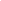

# Upgrading and Downgrading

BandMath offers different subscription tiers to fit the needs of your tour. Whether you just need the core financial ledger, or you want to unlock advanced features like the Merch Analyzer, managing your subscription is easy.

## Subscription Tiers

You can view the current available tiers and their features by navigating to the **Billing** tab in your Band Settings. 
* **Core Ledger:** Basic transaction tracking, automated debt settlement, and basic team management.
* **Merch Manager:** Unlocks the Point-of-Sale (POS) system, advanced inventory tracking, and deep insights from the Merch Analyzer.

## How to Upgrade

To upgrade your band's workspace:
1. Navigate to the **Band Settings** page.
2. Select **Billing**.
3. Choose the tier you want to upgrade to and tap **Subscribe**.
4. You will be redirected to our secure Stripe checkout portal to enter your payment details.

Once the payment is successful, BandMath will automatically unlock the premium features for your entire band workspace. Note that only one subscription is required per band, not per user!

> [!WARNING]  
> Only **Admins** have the permission to change the band's subscription tier. If you are a Member and need to upgrade, please contact your Admin.

## Downgrading

If your tour is over and you no longer need the advanced features, you can downgrade your workspace at any time.

1. Go to the **Billing** tab in Band Settings.
2. Select **Manage Subscription**.
3. You will be taken to the Stripe customer portal where you can select a lower tier.

Your premium features will remain active until the end of your current billing cycle, after which you will be moved to the downgraded tier. Your historical data from the higher tier (like past merch sales) will be preserved, but you may lose access to the advanced analytics dashboards.
