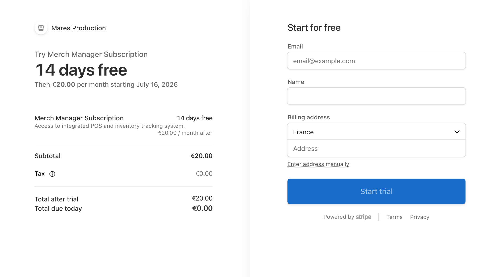

# Upgrading and Downgrading

BandMath offers two subscription tiers to fit the needs of your tour. For the garage bands out there, the core financial ledger is all you need. But when you start moving merch, that's when you're going to want to unlock the power of the Merch Manager with advanced features like the Point Of Sale, the Merch Analyzer, and the Venue Split Calculator.

## The Web Accounts Portal

To keep subscription costs low for independent bands and avoid exorbitant App Store fees, all billing activities are managed exclusively through our dedicated Web Accounts Portal, rather than inside the mobile app.

You can securely manage your subscription at any time by navigating to **account.itsbandmath.com** on your desktop or mobile browser.

## Subscription Tiers

All the Core Ledger features in BandMath are 100% free. You can view the available premium tiers and manage your subscription by navigating to the **Billing** tab in the Web Accounts Portal.

* **Core Ledger:** Basic transaction tracking, automated debt settlement, and team management.
* **Merch Manager:** Unlocks the Point-of-Sale (POS) system, advanced inventory tracking, and deep insights from the Merch Analyzer.

## How to Upgrade

To upgrade your band's workspace:
1. Navigate to the web portal at **account.itsbandmath.com** and log in with your Admin credentials.
2. Select your band from the dashboard and click on the **Billing** tab.
3. Choose your desired tier and click **Subscribe** (or **Get Lifetime** for the Bootstrapper's Club).
4. You will be redirected to our secure Stripe checkout portal to enter your payment details.

Once the payment is successful, BandMath will automatically unlock the premium features for your entire band workspace. Note that only one subscription is required per band, not per user!

:::warning

Only **Admins** have the permission to change the band's subscription tier. If you are a Member and need to upgrade, please contact your Admin.

:::

## Downgrading

If your tour is over and you no longer need the advanced features, you can downgrade your workspace at any time.

1. Go to the web portal at **account.itsbandmath.com**.
2. Select your band and navigate to the **Billing** tab.
3. Click on the **Customer Portal** button under "Manage Billing".
4. You will be taken to the secure Stripe customer portal where you can cancel your subscription or update your payment methods.

Your premium features will remain active until the end of your current billing cycle, after which you will be moved to the standard tier. Your historical data from the higher tier (like past merch sales) will be preserved, but you may lose access to the advanced analytics dashboards. Pick back up where you left off when the time is right for you!
