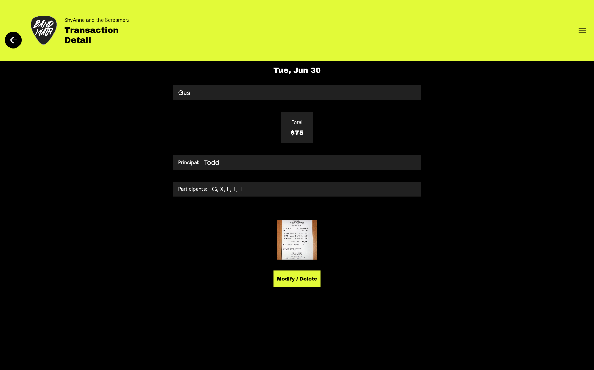
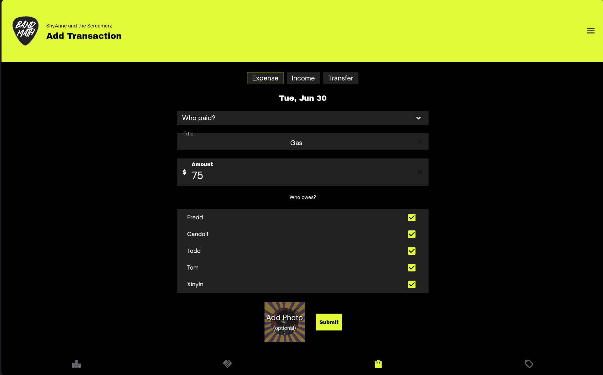

# The Ledger

The Ledger is the core of BandMath. It is a double-entry accounting system tailored specifically for the complexities of touring bands.

## Transactions

Adding, modifying, and deleting transactions is simple. BandMath supports recording:
* **Income:** Anything from nightly venue payouts, to tips, to merch sales.
* **Expenses:** Gas for the van, hotels, gear repairs, and food buyouts.
* **Transfers:** Moving money between the Band Bank, VAT Bank, or individual members.

You have full editing capabilities to ensure the ledger is always perfectly accurate.

## Shared Expenses & Credits

Touring is a team effort. Anyone in the band can pay for an expense and automatically debit any combination of the other members. 

Similarly, anyone can take a payout (like the cash from the venue) and automatically credit the other members for their cut.

## Automated Debt Settlement

This is the magic of BandMath. Instead of creating a complex web of "who owes who" (e.g., the drummer owes the singer for gas, but the singer owes the guitarist for dinner), the algorithm analyzes the net balances of everyone in the band.

It outputs the absolute simplest way to settle all debts with the fewest number of cash transfers.

## Advanced Profit Splitting (The Penny Catcher)

When an expense or income is split among multiple members, the division rarely works out to clean integers ($10.00 split 3 ways is $3.33333...). 

Our proprietary Penny Catcher algorithm ensures that fractions of a cent are never lost or infinitely rounded, guaranteeing that the ledger balances perfectly to the penny.

## The Venue Split Calculator & VAT Integration

Need to calculate a complicated merch split with a venue? The built-in Venue Split Calculator handles the math for you.

When you sell merch or log taxable income, the tax portion of the sale is automatically transferred to the **VAT Bank**. This ensures you don't accidentally spend money that you owe to the government.
