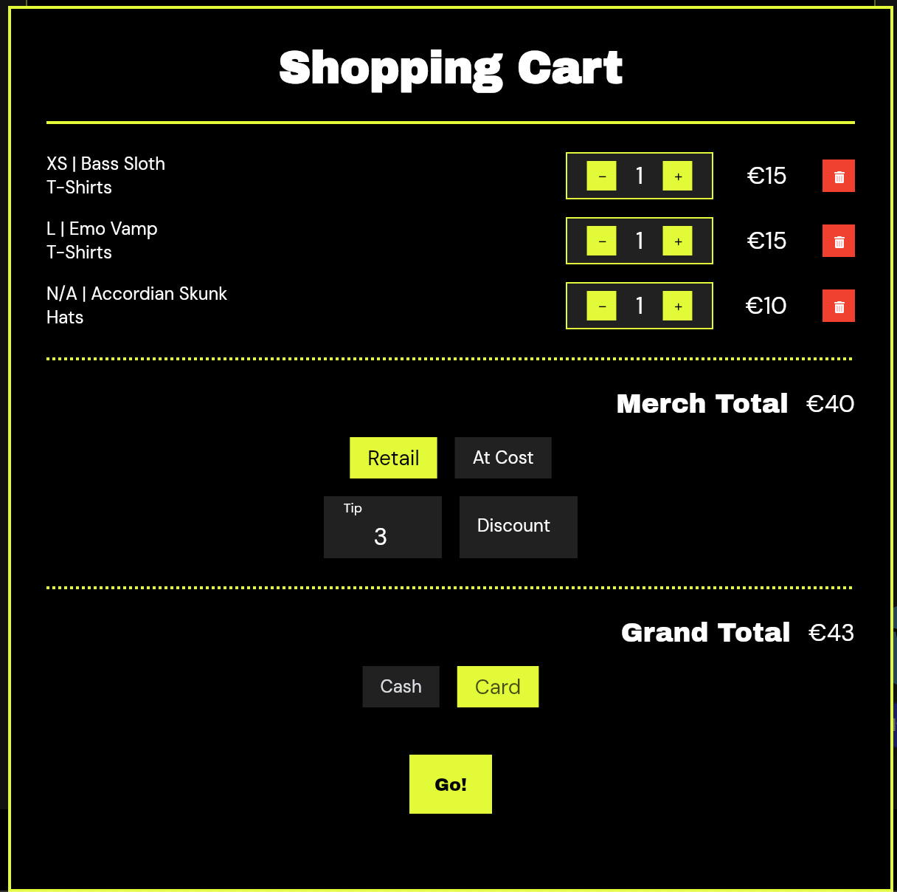

# Merch & POS

BandMath's Merch Manager tier provides everything you need to track your inventory and sell merchandise at shows.

## Inventory Management

BandMath allows you to define your products with extreme granularity:
* **Product Size Management:** Track stock levels for every size of a t-shirt independently.
* **Historical Cost Tracking:** Because the cost of printing t-shirts fluctuates, BandMath tracks the exact production cost of every batch you print, ensuring your profit calculations are always historically accurate.

## The Point-of-Sale (POS) System

When you're at the merch table, speed is everything.

* **Dynamic Cart System:** Add items to the cart with a single tap.
* **Cash & Card Tracking:** Log the exact method of payment to make end-of-night reconciliation a breeze.
* **Discounts & Tips:** Easily apply custom discounts to a cart, or log tips given by generous fans.
* **Customer Email Capture:** Grow your mailing list directly from the checkout flow.

## Real-Time Stock Depletion

As soon as an item is sold through the POS, BandMath automatically deducts it from your global inventory. You'll always know exactly how many Medium shirts you have left in the van.
