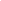

# The Merch Analyzer

Data is power. The Merch Analyzer is an advanced analytics suite available to Merch Manager subscribers. It provides deep insights into your inventory performance so you can make smarter decisions for the next tour.

## Profit & ROI Tracking

Stop guessing which designs are actually making you money. The Merch Analyzer breaks down:
* Total revenue generated per item.
* Exact profit margins (factoring in historical production costs).
* Return on Investment (ROI) for specific merchandise runs.

## Restock Warnings

Never run out of your best sellers mid-tour. The Merch Analyzer tracks your average sales velocity and visually flags items that are running dangerously low on stock.

## Trophy Awards

We've gamified merch sales! The Analyzer automatically awards trophies to your best-performing items (e.g., "Fastest Seller", "Highest Profit Margin"), so you can quickly identify the stars of your merch table at a glance.

