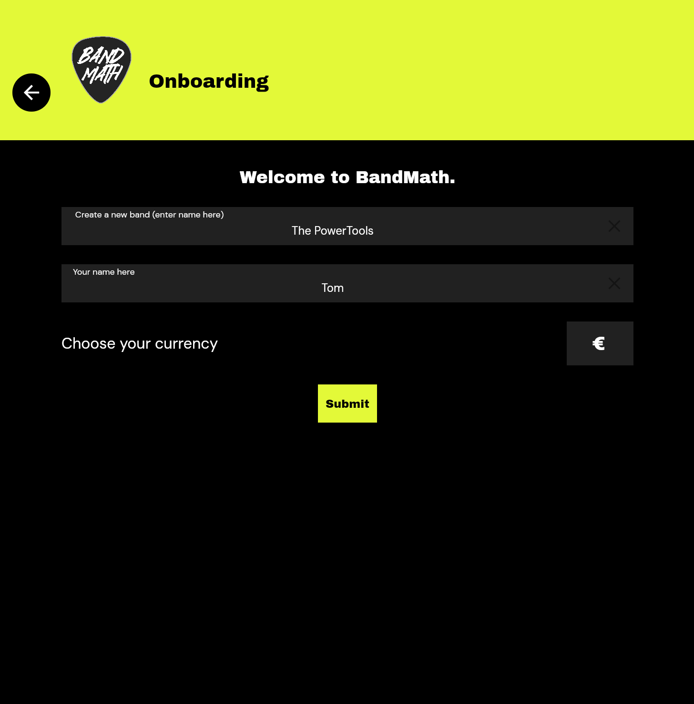

# Creating a Band

Welcome to BandMath! Setting up your band is the first step toward gaining total financial clarity for your tours and merchandise.

## The Band Profile

When you first sign up for BandMath, you will be prompted to create your Band Profile. This profile acts as the central hub for all of your band's financial data, merchandise inventory, and team members.

### Setting Your Base Currency

During setup, you will be asked to select your band's base currency (e.g., USD, EUR, GBP). 

> [!NOTE]
> BandMath handles all math natively using integers, which means the currency setting is purely a **display symbol**. You can change your workspace's currency symbol at any time in the settings. For tours in foreign countries, check out our [Multi-Currency Touring](../Advanced_Workflows/02_Multi_Currency_Touring.md) guide.

## The Default Banks

Upon creating your band, BandMath automatically creates two special "members" in your roster:
1. **The Band Bank:** Represents the communal pool of money owned by the band as an entity (e.g., your actual shared bank account or a physical cash box).
2. **The VAT Bank:** Used exclusively for setting aside value-added tax (VAT) or sales tax collected during merch sales. 

These banks are crucial for the double-entry accounting system and cannot be deleted.

## Next Steps

Once your band profile is created, you automatically become the **Admin**. Your next step is to start building out your roster by [inviting your band members](./02_Inviting_the_Band.md).
