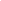

# Inviting the Band

BandMath is built for collaboration. To get the most out of the platform, you should invite your bandmates, tour managers, and merch sellers to join your band's workspace.

## How to Invite Members

As an Admin, you can invite new members to your band by generating an **Invite Code**.

1. Navigate to the **Band Settings** page.
2. Select **Manage Members**.
3. Click **Add Member** and enter their name and role.
4. An invite code will be automatically generated. Share this 6-character code with your bandmate.

## The Invite Code Process

When your bandmate downloads the BandMath app, they will create their own user account. On the welcome screen, they will select **Join Existing Band** and enter the 6-character invite code you provided. 

This securely links their user account to your band's workspace and grants them access to view the ledger and log transactions.

## Shadow Profiles (For Members Without the App)

We know that not everyone in the band will want to download a finance app (we're looking at you, drummers!). 

BandMath solves this with **Shadow Profiles**. When you add a member to the roster, they are initially created as a Shadow Profile. This means they exist in the ledger so you can track their shares, debts, and payouts, even if they never download the app.

If a member *does* eventually download the app and uses their invite code, their account is instantly bound to their Shadow Profile, and they gain access to all their historical transaction data.

For more details on member permissions, see [Admins vs. Members](../Team_Management/01_Admins_vs_Members.md).
