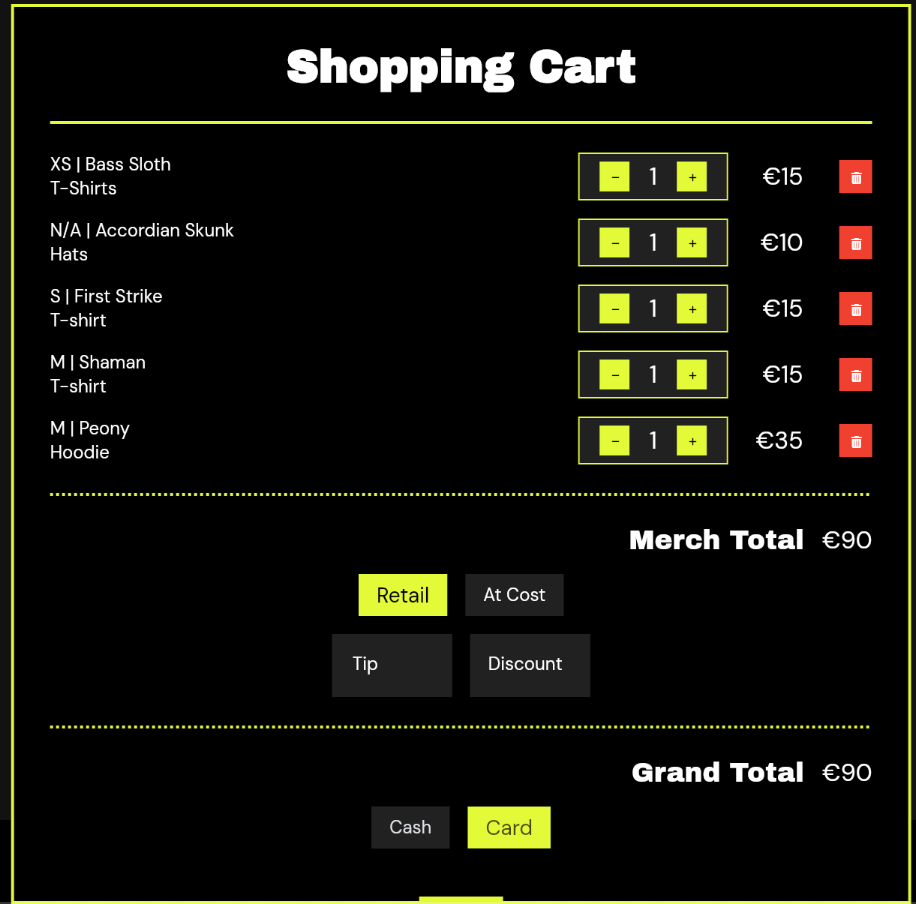

# The First Tour: A Quick Walkthrough

Ready to hit the road? Here is a quick 5-minute walkthrough of the core BandMath loop to get you started on your first tour.

## 1. Log an Expense

Did someone buy gas for the van?
1. Tap the shopping bag icon in the bottom nav bar and navigate to the **Add Transactions** page.
2. Tap the **Expense** button.
3. Select *who paid* for the gas, type in Gas and enter the amount paid. Then select the band members who should split the cost in the *who owes* section.
4. Upload a photo of the receipt. 
5. BandMath automatically splits the expense and updates everyone's internal balances.
6. Check out the results in the Transaction Feed and on the Standings page by tapping the graph icon in the nav bar. 

## 2. Add Your Inventory

Before you can sell merchandise, you need to tell BandMath what you have in stock. This is a simple 3-step process:

1. **Create Items:** Navigate to the Create Items menu from the pop out drawer on the right side then select "Add/Edit Merch Types". A merch type is anything you can print on—from T-Shirts and hats, to lighters or even a Limited Edition custom flowerpot. Merch types are totally customizable and unlimited.

   

     
     
   

2. **Add Designs:** Next, you add Designs to your merch types. Give the design a name and upload an image of the item. If you don't have an image handy, just click submit and a stock Groovatar image will be used instead.

   

3. **Add Inventory:** Now that the item conceptually exists, go to the Add Inventory page. Choose your Product Type and Design, input the unit cost and retail price, and finally input how many of each size you bought (items without sizes like hats or lighters go in "N/A").

   

## 3. Log a Sale (The POS System)

When you're at the merch table after a show:
1. Open the **Merch Manager** tab in the bottom nav bar by clicking the Price Tag icon on the far right side.
2. Tap the Sell button next to each item the fan wants to buy to add them to the cart.

   

3. Select the payment method (Cash or Card).
4. Hit **Checkout**. 

    

BandMath instantly records the revenue, deducts the items from your inventory, and calculates the profit.

## 4. Check the Standings

At the end of the night (or the end of the tour), navigate to the **Standings** page. 

Here, you'll see the magic of BandMath's [Automated Debt Settlement](../Features/01_The_Ledger.md#automated-debt-settlement). Instead of a tangled web of "who owes who," BandMath calculates the absolute simplest way for everyone to settle up using the minimum number of money transfers.

