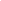

# Localization and Currency

Because BandMath is used by touring bands around the world, you can easily customize the app to fit your region.

## Setting Your Base Currency

When you first [create your band workspace](../Getting_Started/01_Creating_a_Band.md), you will be prompted to select a **Base Currency**. 

> [!WARNING]  
> The base currency is a permanent setting for your workspace. Once your first transaction is logged, the base currency cannot be changed. This ensures that historical financial data and settlements remain perfectly accurate.

The base currency is the primary currency used for all:
* Ledger calculations
* Debt settlements and payouts
* Merch inventory valuations
* Profit and loss reporting

## Currency Formatting

BandMath automatically formats your financial inputs and displays based on your selected base currency. This means that if you choose Euro (€) as your base currency, the app will automatically inject the `€` symbol into input fields like the merch inventory pricing, preventing typos and ensuring a clean user experience.

If you notice a currency symbol is missing or incorrect, please reach out to support.
