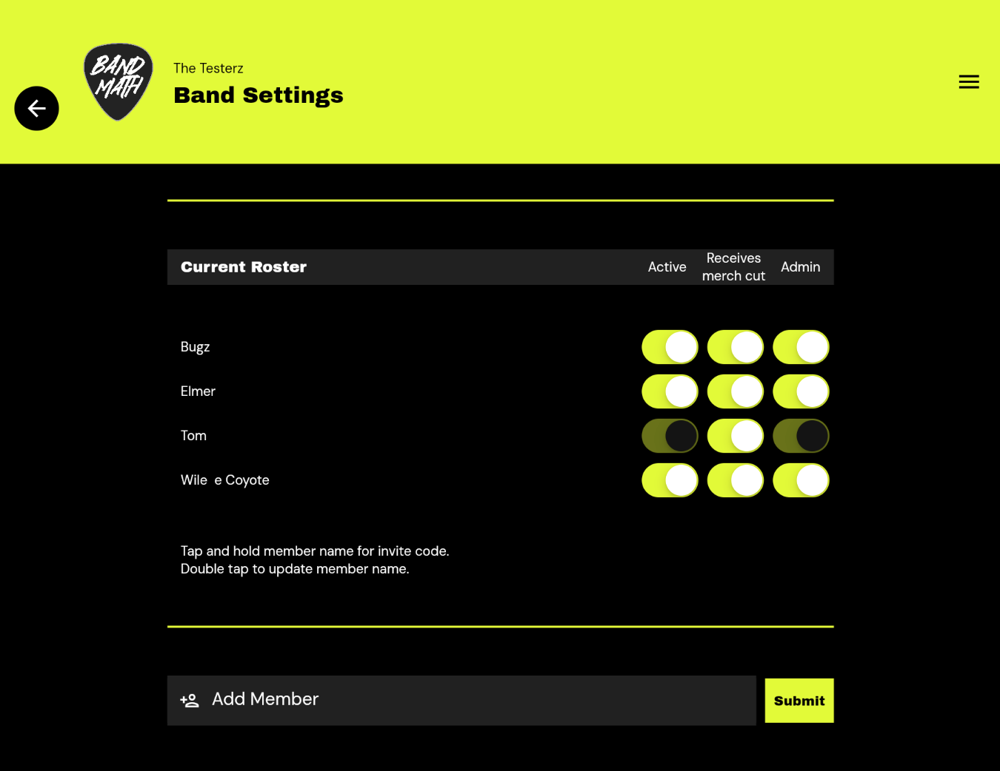

# Admins vs. Members

BandMath uses a simple but strict role-based permission system to ensure your financial data remains secure and organized. There are two primary roles in any band workspace: **Admins** and **Members**.

## Admins

The user who creates the band profile is automatically assigned as the first Admin. 

Admins have full control over the band's workspace. Their capabilities include:
* **Managing Members:** Adding new members, generating invite codes, and removing members.
* **Managing Settings:** Changing the band's name, base currency, and other core settings.
* **Managing Billing:** Upgrading or downgrading the band's subscription tier.
* **Merch Management:** Full access to add, edit, and delete merchandise inventory and product definitions.

## Members

Members are the standard users within a band workspace. They have the ability to participate in the financial ecosystem but with restricted administrative access.

Members can:
* **Log Transactions:** Add new expenses, incomes, or transfers to the ledger.
* **Edit Transactions:** Edit or delete any transaction in the ledger, regardless of who created it.
* **View the Ledger:** See all transactions and the current standings/settlements.
* **Sell Merchandise:** Use the Point-of-Sale (POS) system to log merch sales.

Members **cannot**:
* Access the Band Settings page.
* Remove other members from the band.
* Change the band's core settings or billing tier.

:::tip

A band can have multiple Admins. An existing Admin can promote any Member to an Admin role from the Band Settings page.

:::
